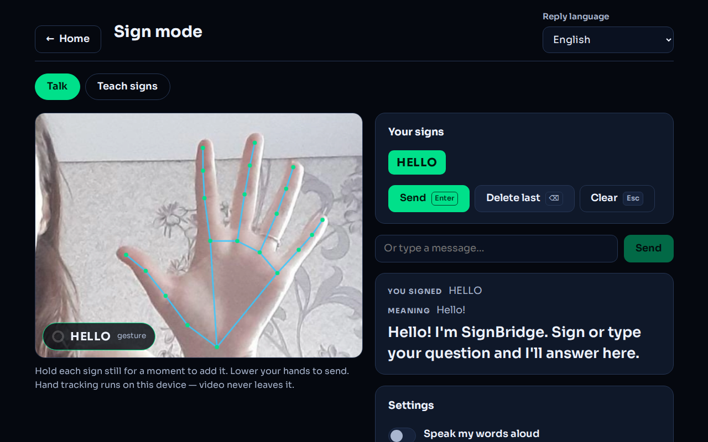
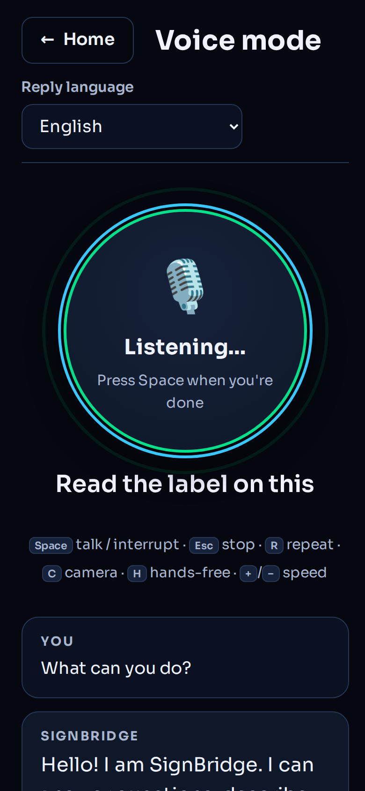

# SignBridge 🤟

**Connect your way.** SignBridge brings two people into one conversation. Each person chooses **Type / Speak / Sign** input and **Text / Read aloud / Screen reader** output, with optional saved sign-video playback. Camera and microphone sharing start only when chosen. AI help is optional; human messages and live signing do not need a Gemini key or a recognition model.

[](https://render.com/deploy?repo=https%3A%2F%2Fgithub.com%2FADjayantan%2Fsignbridge-%2Ftree%2Fcodex%2Frender-pilot)

**[Open the live Free pilot](https://signbridge-conversations.onrender.com/#connect).** The public source is on [`codex/render-pilot`](https://github.com/ADjayantan/signbridge-/tree/codex/render-pilot). Render deployment and remote text-protocol checks passed on 8 October 2026. Service automatic deployments are off; Blueprint configuration syncs and deliberate deploys can still restart rooms. Private TURN setup and physical-device checks remain pending. See the [deployment guide](docs/conversations-deployment.md), [remote verification](docs/render-pilot-verification-2026-10-08.md) and [local/cloud implementation plan](docs/parallel-implementation-plan-2026-10-08.md).

The [full external LSTM repository assessment](docs/external-lstm-full-analysis-2026-10-08.md) informs a newly implemented [training-only LSTM75 control](docs/temporal-lstm-control-2026-10-08.md). It has synthetic engineering verification, not trained sign-accuracy evidence. No application model was replaced or promoted.

## Start a conversation

1. Open Home → **Start conversation**, or `/#connect`, and set **Communication preferences** on your device.
2. Choose **Create invite link** and share it privately. Your partner opens the link and chooses **Join room**. There are exactly two participant slots.
3. Type a reviewed message and choose **Send to partner**. For speech, choose **Speak → Start dictation → Finish dictation**, correct the transcript, then send. For natural signing, choose **Turn camera on**. Camera/mic off and typing/text are the defaults.
4. Optional **Sign → Enable local word recognition** captures a whole word for review/correction and appending to the draft. Local research weights are required; this does not translate continuous signing. Natural live video works without them.
5. Change preferences during the conversation. **Show saved sign videos** uses that device's existing library; missing phrases remain text. Live video does not translate ISL into ASL or vice versa.

The latest 200 messages stay temporarily in server memory. Transport interruption preserves participant slots and the tab's draft; same-ID retries do not duplicate messages. **Leave room**, **End for both**, and opening a separate Tool end the conversation when the server can be reached. An offline exit releases this device’s media but cannot notify the partner; they can leave/end on their device. Reconnect before using End for both. Empty rooms expire after 30 minutes; server restarts also end them. Preferences are browser-local; drafts and room credentials use tab-scoped session storage.

Software and public pilot source have been pushed to GitHub and deployed on Render Free. **Remote synthetic HTTPS/WSS text checks passed; private Metered setup and physical laptop/mobile tests on different networks are pending.** Automated media tests simulate devices/WebRTC. See [hand recognition activation and tracking feedback](docs/hand-recognition-2026-10-03.md), [conversation retest and fixes](docs/retest-2026-10-03.md), [initial workflow verification](docs/conversation-quality-verification-2026-10-03.md), [earlier conversation verification](docs/conversations-verification-2026-10-02.md), and [deployment and physical-device acceptance](docs/conversations-deployment.md).

## Clarify messages and review plans together

Ordinary **Send to partner** stays one action. These tools are optional within the same conversation:

- **Clarify this:** attach a repeat/time-place request or a question to a received message. Its sender answers through the reviewed draft. The requester can mark the request resolved; that records their action rather than proving understanding.
- **Correct message:** send a new correction linked to your original message. The original wording remains visible, and links return keyboard focus to it.
- **Add meeting details:** share a date, time, time zone, place and optional note. Each person approves only the current revision for themselves. Editing details creates a new revision and clears both approvals. Stale edits/approvals require a fresh review.
- **Shared references:** write a label and description, then optionally attach up to three to a message. A sent message retains the exact reference revision, label and description even after the shared reference changes. There are no reference uploads or automatic image descriptions.

Read aloud and screen-reader output include linked-message context, meeting fields and reference descriptions. Received live updates announce once; restored history does not replay on reconnect or preference changes. Saved sign videos remain exact local phrase/vocabulary matches with missing coverage shown explicitly.

Unconfirmed actions keep their original ID and details for an explicit retry; approvals never retry automatically. Reconnect reconciles accepted actions even if older events were pruned. Shared workflow data disappears when the room ends or the server restarts. Limits are 200 retained events, 100 clarification requests, 25 meeting cards, 20 revisions per card, 25 references and 256 KB of workflow data; a full room asks you to start a fresh one.

The contribution is a workflow hypothesis, not an established novelty or usefulness result. [The public comparison](docs/workflow-comparison-2026-10-03.md) records known/unknown advertised capabilities. [The consented pilot protocol](docs/user-pilot-protocol-2026-10-03.md) and [blank 50-attempt run sheet](docs/user-pilot-run-sheet.csv) are ready; no volunteer results have been collected.

## Existing tools and sign research

| Sign mode | Voice mode |
| --- | --- |
|  |  |

- **Sign Workspace:** capture complete words with the existing local temporal models (**49 ISL / 100 ASL words**), review or correct them, and compose an editable message with undo. Speak locally or send reviewed text for a contextual AI reply and available saved sign videos. Dataset test top-1 remains **75.0% ISL / 40.8% ASL**; this interface upgrade does not establish new laptop signing accuracy or full sentence translation.
- **Training Studio:** consent to save labelled body/hand pose sequences locally, inspect ISL/ASL samples and export batches for a separate training run. The offline importer validates data and explicit signer-separated splits. Saving a sample does not retrain or replace a model.
- **Live Sign:** start an AI practice session, record a short signed turn, choose to send the video for experimental interpretation, correct its tentative meaning, and get an AI reply. Keep going in the same conversation. This is a working conversation interface and video API integration, **not a validated full ISL/ASL model**.
- **Personal signs & face-to-face**: the original local camera tracks your hands. Hold a known static sign to add a word, review or correct the words, and speak them aloud or send them to AI. English glosses are spoken in English; speech does not automatically translate them.
- Local recognition uses your saved static signs. The camera panel lists this vocabulary. **Gesture shortcuts are off by default** to avoid reading an unknown open-handed sign as HELLO; enable them explicitly for the seven-gesture demo. See [the HELLO troubleshooting steps](docs/realtime-test-cases.md#if-it-only-says-hello).
- **AI voice assistant:** talk and hear the answer, hands-free. Answers start playing while the AI is still writing. Keyboard and screen-reader controls are available. Turn on the camera and ask "what's in front of me?" or "read this label". This separate tool uses Gemini; room speech dictation does not automatically ask AI.

## Sign speech and video upgrade

### Sign Workspace: trained ISL / ASL words and reviewed conversation

Open `/#trained-sign` (also `/#sign-workspace`) or choose **Sign to text & voice** under Home → **Quick tools**. The page has three steps: **Sign → Check → Text & voice**. Select the sign language, then **Start camera → Capture a sign → Finish sign**. Review or correct the result, **Add word to message**, then **Speak my message**. Camera controls sit above the preview; result focus follows Finish, and message focus follows Add. You can type directly in step 3 without a camera or model. **Stop speech**, **Undo last edit** and **Clear message** are beside the primary speech action. Keep shoulders and your signing hands in view. Space starts/finishes a turn outside form controls; Escape cancels capture or interrupts pending AI work. End session stops the camera and speech and clears the draft. Changing either language clears this page's draft, results and AI conversation.

Capture waits for a measured tracking frame. If new frames stop for two seconds, the page labels hand tracking paused and disables new captures. Finish/Cancel and reviewed text remain usable. Retry tracking or resume fresh camera frames before starting another turn.

Open **Supported words** to check the actual loaded language and vocabulary. Search a word before capturing; the search never tells the model what to predict. DRINK is in the local ASL artifact and absent from ISL; STOP is absent from both. After Finish, **More result options → Why this result?** distinguishes capture failures from score/separation rejection and shows no measured confidence when inference never ran. Its **Download recognition report** action exports tentative labels and scalar diagnostics locally, excluding video, joint coordinates and reviewed text. It does not send a message or create a training sample. See [recognition feedback and verification](docs/recognition-feedback-2026-10-05.md). A vocabulary match does not guarantee recognition.

Choose **Text & voice** for local output or **AI assistant** for an AI reply. Home's **Talk to AI with signs** opens the AI purpose directly. **AI replies (optional)** holds the explicit **Send reviewed message** action, reply-language and AI reply controls. Choosing AI opens that section; switching to local output interrupts pending AI work while retaining the camera and draft. **Advanced settings** holds model/camera selection, landmark numbering, automatic recognized-word speech, capture-quality measurements and dataset evaluation. Optional sections preserve the camera and reviewed draft when toggled. Home's **More tools** holds Training Studio, saved sign videos and experimental video practice.

**Talk to a partner** opens Connect, stops this page's camera and copies reviewed text into an empty room draft. If a room draft already exists, choose **Add to my draft** or **Use this message instead**; overflow preserves both texts. Nothing is sent or spoken automatically. See the [destination flow, capture fix and measured research outcome](docs/live-bridge-2026-10-05.md).

Uncertain matches may show up to three tentative suggestions; choosing one is a manual correction, not a successful prediction. Capture quality shows duration, hand/shoulder visibility, sample rate and tracking gaps to help framing; it does not grade signing correctness. Failed or interrupted AI requests retain the draft for retry, completed replies retain recent conversation context, and **New conversation** clears that context. Replies can use your saved sign-video library with missing coverage shown explicitly. Without an AI key, recognition, review, editing and local speech remain available.

The model learns ordered body-and-hand movement with a GRU; it does not map every open palm to HELLO. Capture runs for at most 12 seconds. No words are predicted while a turn is still being captured. Missing hands/body, short turns and uncertain matches are rejected. Rejection is imperfect: unknown-vocabulary test clips were falsely accepted in **13.5% of ISL trials and 4.5% of ASL trials**. ASL also rejects most known words at the current strict threshold. Review results before using them.

Recognition and pose processing run locally. Initial tracker/model downloads need a connection; offline use of this new mode has not been verified. These models recognize isolated words, not continuous sentences or facial grammar. Reply videos come from saved library clips. The learned weights are present on this laptop at `public/models/isl.json` and `public/models/asl.json`; datasets, environments and weights are ignored by Git. A new checkout needs the documented training procedure. See [the actual training results and reproduction steps](docs/model-training-2026-10-01.md).

*Archived test capture omitted from this public source snapshot.*

### Training Studio and webcam data

After finishing a capture, expand **Save this turn for model training**, verify its label with someone who knows the sign language or choose a rejection example, enter a stable anonymous signer code and choose the consent checkbox. Unknown examples distinguish **No intentional sign**, **Sign outside the supported vocabulary** and **Unsure / not reviewed**. A failed prediction does not verify a training label or automatically identify nonsigning. The current session code is recorded automatically. The saved sequence contains landmark coordinates, confidence values and frame timing, plus the label and original prediction; it contains no video or audio. A known-word sample needs at least four frames with a hand and both shoulders visible together. Nothing is saved automatically.

For examples that need no sign-language knowledge or word model, open **Training Studio → Record no-sign examples · no sign-language knowledge needed**. Explicitly start the camera, record three seconds of idle/everyday movement, review tracking, then choose separate nonsigning attestation and local-storage consent before Save. Closing the tool releases the camera and discards unsaved recording. It stores an unknown sample with an explicit nonsigning subtype and actual recording window; the importer retains these separately from model calibration arrays. See [capture readiness, nonsigning collection and verification](docs/nonsigning-collection-2026-10-05.md).

Open `/#training-studio` to inspect the inventory, filter ISL/ASL, delete an individual sample or export JSON. The browser inventory is capped at 250 samples and 32 MB. Export and verify backups before removing samples for the next batch; exports across batches must use disjoint sample IDs and consistent signer codes. The importer combines repeated `--dataset` inputs, requires explicit train/validation/test signer assignments and rejects overlap or malformed data. An incomplete collection produces an inventory explaining missing training requirements. It never retrains or replaces deployed weights. See [the software upgrade guide and verification](docs/software-upgrade-2026-10-02.md) for the import command and boundaries.

### Live Sign conversation

Open `/#live-sign` or choose **Experimental video practice** under Home → **More tools**. **Start sign session → Sign your turn → Finish signing → preview → consent → Interpret my signs → correct meaning → Confirm meaning & get reply**. The camera stays available for the next turn. **Interrupt** cancels pending work; **End session** stops the camera, cancels recording, requests and speech, and discards the draft video. Completed text turns remain in memory until you leave the mode. Changing either language ends the session.

- Camera capture records **video only**, up to 12 seconds and 2 MB, at a target 700 kbps. You can import a playable MP4 or WebM under the same limits. Imported clips may contain audio, which is disclosed before sending.
- Manual finishing is the default. Optional hands-down finishing waits for visible hands, at least 2 seconds of recording, then 1.2 seconds without hands. It does not interpret motion or detect linguistic sentence boundaries.
- Video interpretation uses Gemini's video input with **8 FPS sampling**, full recorded framing, separate ISL/ASL instructions and strict structured output. `unclear` and `no_sign` results cannot populate a guessed meaning. Every interpreted meaning needs user confirmation before becoming a chat turn. Sampling is an engineering choice, not an accuracy result. See [Google's video input documentation](https://ai.google.dev/gemini-api/docs/generate-content/video-understanding).
- Confirmed messages are sent as natural text, with recent completed conversation history. Failed requests retain the reviewed message for retry. Interrupted or stale answers cannot enter history or be spoken.
- Replies have text, optional speech and exact phrase/vocabulary playback from your local sign-video library. **No signing avatar or generated fluent sign sentences are claimed.** There are no bundled human signing videos; missing coverage stays visible.
- **Speak my message** works on a reviewed/typed meaning without an AI request. AI interpretation and answers require a server-side Gemini key. The page checks configuration and shows setup instructions; a configured key is not proof that upstream inference works.

*Archived test capture omitted from this public source snapshot.*

For implementation, data boundaries and the work needed for a trained sign model, see [Live Sign design](docs/live-sign-design.md).

### Local tools and reply videos

- **ISL and ASL are separate libraries.** In the personal tools, the sign-language selector changes your static-sign recordings and video dictionary; it does not train those personal signs. The trained-word mode loads separate ISL/ASL learned weights. The reply-language selector chooses the text/AI language. Original recordings are preserved in the ISL library. Switching sign language clears the current conversation and camera state.
- **Sign → speech without an AI key.** Press **Speak words** on the reviewed transcript, or enable **Speak each recognized sign**. Speech availability depends on installed/browser voices. AI interpretation is no longer needed to speak recognized words.
- **Sign-video replies.** In **Sign videos**, record up to 12 seconds from the camera or import an MP4, WebM or Ogg clip (maximum 20 MB). Give it the exact phrase, sign language and phrase text language. Preview before saving. Reply playback uses only clips in the selected sign language and matching text language, with replay, pause and slower playback.
- **Honest coverage.** Complete matching phrases use their saved video. Otherwise, longest matching vocabulary clips play in text order; uncovered words remain visible and pause the sequence. This is vocabulary playback, not grammatical sentence translation. No human sign videos are bundled. Contributor labels and signing need checking by a fluent signer.
- **Face-to-face bridge.** Enable the bridge in Talk. Your reviewed signs are spoken to the other person. Their speech or typed message becomes captions and matching sign-video playback, without calling Gemini. Browser speech recognition may still require the internet and use the browser vendor's service.
- **Recorded video recognition.** Choose **Recognize a video**, then use the video controls to scan local footage for your known static signs. The video stays local; only recognized words are sent if you choose AI mode. This does not recognize previously untrained moving signs.
- **Camera feedback.** See actual inference FPS, runtime backend and model confidence. **Careful** mode uses a longer hold, higher score thresholds and rejects hands touching the frame edges. These are configurable rejection rules, not evidence of increased accuracy. Pause the camera when using text or sign-video playback.

Sign videos are stored as blobs in IndexedDB, limited to 150 MB per library database. They survive app restarts and work offline after the app has been cached, but are tied to this browser and origin. **Download clips for backup**; clearing browser data removes them. Videos are not uploaded. Duplicate phrases cannot silently replace an existing clip. Static-sign export files include their sign language, and imports reject a mismatched language.

For sign vocabulary review, use the [ISLRTC dictionary](https://divyangjan.depwd.gov.in/islrtc/) and [ASL University](https://www.lifeprint.com/). Reference links do not import or redistribute those sites' videos.

## Install it as an app

SignBridge is an installable app (PWA). In Chrome or Edge, press **Install the SignBridge app** on the home screen (or the install icon in the address bar); on Android, choose **Add to Home screen**; on iPhone, **Share → Add to Home Screen**.

- Opens instantly after the first visit; the hand-tracking runtime and model are cached the first time sign mode opens.
- **Personal static-sign recognition and saved videos work offline after caching.** Rooms, remote video, Live Sign interpretation and AI answers need the internet. A cached app shell does not restore an ended room.
- Long-press the app icon for shortcuts straight into **Voice mode** or **Sign Workspace**.

## How it works

```
ROOM   reviewed text / dictation / reviewed local signs ─► authenticated WebSocket
                 ─► partner text / local speech / screen reader / saved sign clips
       camera + mic ─► WebRTC ─► partner video/audio (TURN relay when configured)
                 └► explicit Optional AI help ─► authenticated /api/chat

TRAINED camera ─► Holistic body + both hands ─► whole-word capture
                 ─► 32-frame pose features ─► trained GRU ─► reject or review
                 ─► editable message ─► local speech / contextual AI + saved sign clips
                 └► explicit sample consent ─► Training Studio ─► export ─► offline preparation

LIVE   camera ─► short video ─► preview + consent ─► /api/chat (sign-video)
                 ─► Gemini tentative interpretation ─► user correction + confirmation
                 ─► /api/chat (sign) ─► answer + optional speech + saved sign clips

LOCAL  camera ─► MediaPipe Gesture Recognizer (WebAssembly, on device)
                 ─► 21 landmarks per hand ─► features ─► taught signs (k-NN) + 7 built-in gestures
                 ─► smoother (hold 0.7 s) ─► words ─► /api/chat ─► Gemini ─► { meaning, reply } ─► big text

VOICE  mic ─► Web Speech API ─► /api/chat (streaming) ─► Gemini ─► sentence splitter ─► speech ─► listen again
                                    ▲ optional camera photo
```

- **Hand features** (`src/lib/features.js`): each hand is described in its own 3D frame (wrist, middle knuckle, knuckles across the palm), so a handshape gives the same numbers wherever it is, at any distance and at any tilt. Hand direction and palm direction are added separately, because orientation matters in sign language (👍 vs 👎). Signs taught with one hand also work with the other (mirroring).
- **Teach your own signs** (`src/lib/knn.js`): record a sign for 2.5 s; SignClassifier stores the frames and recognizes them with k-nearest neighbours. Frames that are far from every taught sign are rejected, using a per-sign threshold calibrated from that sign's own samples.
- **Smoother** (`src/lib/signSmoother.js`): a word is added only after it has been the steady prediction for 0.7 s, and the same word again only after the hands change.
- **AI proxy** (`server/chat.js`): the only code that talks to Gemini. The API key stays on the server. Voice answers stream as NDJSON; sign answers use Gemini's JSON schema output.
- **Speed**: hand tracking picks MediaPipe's GPU or CPU backend. On machines where the GPU runs in software (lab PCs without drivers, VMs), the GPU backend is about 20× slower, so SignBridge detects that and uses the CPU.

## Measured accuracy

These original static-photo measurements do not evaluate Live Sign, temporal signs, fluent sentence translation, or ISL/ASL grammar.

Measured with MediaPipe on 128 real photos from the [HaGRID](https://github.com/hukenovs/hagrid) dataset, where every photo is a different person:

| What | Result |
| --- | --- |
| Hands found in gesture photos | 110 of 116 (95%) |
| Built-in gestures recognized (✋ 👍 👎 ✊ ☝️ ✌️, above the app's confidence cut-off) | 71 of 78 (91%) |
| Photos without a built-in gesture that still produced one (mostly 🤙 read as 👍) | 5 of 38 |
| Taught signs recognized for people who didn't teach them (3–5 signs, about 6 photos each) | 73 of 77 (95%) |
| Untaught handshapes correctly ignored | 117 of 172 (68%) |

When the same person teaches and uses the signs, as intended, recognition is easier than this. Taught signs take priority over built-in gestures, so teaching 🤙 fixes the 🤙/👍 mix-up.

## What works today, and what doesn't yet

- ✅ Two-person rooms, invites/authentication, reviewed drafts, receipts, communication preferences, reconnect and optional AI help are implemented. Video/mic sharing and relay negotiation have simulated media coverage. Physical cross-network calls and fluent-signer trials remain pending.
- ✅ Real-time hand tracking, built-in gestures, teaching and recognizing your own **static** signs (one or two hands), AI replies, streaming speech, camera descriptions.
- ⚠️ **Live Sign is experimental.** Its video API can examine movement, but signing accuracy and latency have not been evaluated with real ISL/ASL signers. A generic multimodal model is not a substitute for a validated sign-language model. Dedicated moving-sign recognition and fluent sentence translation remain unfinished.
- ⚠️ Speech input needs Chrome or Edge. Voices depend on the browser: Edge has natural Indian voices, including Tamil; Chrome on Windows usually has no Tamil voice unless one is installed in Windows. SignBridge warns when a voice is missing.
- ⚠️ Not a mobility aid. The AI is told never to say that something is safe.

## Run it locally

Needs Node.js 22.12+. A Gemini key from [Google AI Studio](https://aistudio.google.com/apikey) is optional. Human conversation, live signing, reviewed dictation, local speech, recognition and the video dictionary do not need it.

```powershell
npm install
if (-not (Test-Path -LiteralPath .env.local)) { Copy-Item -LiteralPath .env.example -Destination .env.local }
npm run rooms                     # terminal 1: room server, port 3001
```

In a second terminal, from the same project directory:

```powershell
npm run dev                       # http://localhost:5173/#connect
```

Vite proxies room HTTP/WebSocket traffic to port 3001; keep `PORT=3001` for this workflow. Its AI middleware still serves separate AI tools. `npm run rooms` loads an existing `.env.local` using Node's environment-file option. Never overwrite a private configuration or put keys in `VITE_*` variables.

Use another browser/private window for a second local participant. Copied tabs can inherit the same session credentials and replace one another. This is not a physical-device test. A phone's ordinary `http://192.168...` URL is not a secure camera/mic context; use deployed HTTPS for physical-device acceptance.

```powershell
npm run check                     # Node + UI tests + local production/PWA build
npm run build:public              # public pilot; excludes local research weights
npm run rooms                     # built-site smoke: http://localhost:3001/#connect
```

For hosting, `npm start` serves `dist`, APIs and WebSockets on `0.0.0.0:$PORT` (default 3001). It uses hosting environment variables rather than automatically loading `.env.local`. `npm run preview` does not provide the standalone room backend.

## Deploy the conversation pilot

The [live pilot](https://signbridge-conversations.onrender.com/#connect) runs as a **Render Node Web Service on the Free compute plan**. `render.yaml` defines `npm ci --include=dev && npm run build:public`, `npm start` and `/api/health`. Including development dependencies supplies Vite during the production build. Same-origin hosting needs no `VITE_ROOM_SERVER_URL`. Private Metered setup remains necessary for relayed video. Open Relay advertises 20 GB/month free usage; account limits apply. See [the runbook](docs/conversations-deployment.md), [Render Free](https://render.com/docs/free) and [Metered Open Relay](https://www.metered.ca/tools/openrelay/).

`build:public` excludes local research weights. The standalone server refuses `/models/isl.json` and `/models/asl.json` even if a local build copied them. Public rooms still support natural signing; optional isolated-word recognition explains missing weights. Saved videos/samples remain tied to their original browser and origin.

### Vercel hosts the existing tools separately

`api/chat.js` and `vercel.json` provide the existing AI function/static hosting, not the persistent room server. A separate Vercel frontend needs public build command `npm run build:public`, build-time `VITE_ROOM_SERVER_URL` pointing to Render's HTTPS origin, and that frontend origin in Render's `ROOM_ALLOWED_ORIGINS`.

Room Optional AI help uses the room server. Older AI tools use the Vite/Vercel function; they do not supply member credentials and cannot call the authenticated standalone AI endpoint directly. Local recognition/speech/saved videos still work. Vercel's original AI route has separate origin controls and lacks the standalone room server's authentication/rate limits.

| Variable | Default | Purpose |
| --- | --- | --- |
| `PORT` | `3001` locally | Standalone listener; leave Render's provided port unchanged |
| `ROOM_ALLOWED_ORIGINS` | same host and localhost | Additional comma-separated frontend origins for room HTTP/WS access |
| `METERED_DOMAIN` | unset | Account application hostname, e.g. `your-app.metered.live` |
| `METERED_TURN_API_KEY` | unset | Private TURN REST API key; server only |
| `VITE_ROOM_SERVER_URL` | same origin | Public HTTPS room-server origin for a separate frontend; rebuild after changing |
| `GEMINI_API_KEY` | unset; optional | Server-only key for explicit AI help / AI tools |
| `GEMINI_MODEL` | `gemini-3.5-flash-lite` | AI text model override |
| `GEMINI_SIGN_MODEL` | `gemini-3.5-flash` (or `GEMINI_MODEL` if set) | Dedicated experimental video interpreter |
| `GEMINI_THINKING_LEVEL` | model default | `minimal`, `low`, `medium` or `high` |
| `ALLOWED_ORIGINS` | unset | Additional Gemini handler origin restriction; not authentication |

## Keyboard

| Where | Keys |
| --- | --- |
| Home | <kbd>V</kbd> voice mode · <kbd>S</kbd> Sign Workspace |
| Live Sign | <kbd>Space</kbd> start/finish recording outside form controls · <kbd>Esc</kbd> interrupt capture/AI work |
| Sign Workspace | <kbd>Space</kbd> capture/finish a word outside form controls · <kbd>Esc</kbd> cancel capture / interrupt AI |
| Voice mode | <kbd>Space</kbd> talk / interrupt · <kbd>Esc</kbd> stop · <kbd>R</kbd> repeat · <kbd>C</kbd> camera · <kbd>H</kbd> hands-free · <kbd>+</kbd> <kbd>−</kbd> speech speed |
| Sign mode | <kbd>Enter</kbd> send · <kbd>Backspace</kbd> delete last word · <kbd>Esc</kbd> clear |

Bookmark `/#connect` for human conversation, `/#trained-sign` for Sign Workspace, `/#training-studio` for saved pose samples, `/#voice` for the AI voice tool or `/#live-sign` for experimental video interpretation. Original local tools remain at `/#sign`; reply videos are at `/#sign-videos`.

## Privacy

- **Rooms:** reviewed text and language/input metadata go to the room server and partner. The latest 200 messages stay in memory, with bounded IDs retained separately for deduplication. Credentials/drafts use tab session storage; server credentials are digests. Invites grant the remaining participant slot. This server does not log transcripts or credentials.
- **Calls/dictation:** media goes to the partner through WebRTC, directly or via TURN; SignBridge does not record calls. Recognition shares the local preview. Dictation can use the browser's online service; app speech stops and partner audio is muted during dictation. Optional AI help sends the current draft only when chosen, and its suggestion is not automatically sent.
- **Sign Workspace:** camera frames are processed on the laptop. A completed pose sequence stays in memory for review until the next capture, End or leaving the mode; cancelled captures are discarded. It is saved only after explicit sample consent. Sending a reviewed message sends its text and recent completed chat history to Gemini, not this mode's camera footage. The tracker downloads a Google MediaPipe model asset; learned word weights load from this app's local server.
- **Training Studio:** consented poses and metadata stay in IndexedDB for this browser and origin, capped at 250 samples/32 MB. Exports contain coordinates, timing, labels, prediction metadata and signer/session codes, with no video or audio. Use anonymous participant codes. These records are not automatically uploaded; clearing browser data removes them, so verify exported backups.
- **Live Sign:** camera capture is video-only. A fresh checkbox choice for each clip is required before sending it through SignBridge's server to Google Gemini. Imported clips can include audio, and the consent text says so. Draft clips are held in memory; ending/interrupting discards them. This code does not persist clips on the server or log request bodies. Google processes sent data under the configured account's Gemini terms. Confirmed text and recent completed chat history also go to Gemini.
- **Personal signs & face-to-face:** camera video is processed locally. Only recognized/reviewed words go to AI if you choose AI mode. Saved reply videos remain in the local dictionary and are not automatically uploaded.
- **Voice mode:** the browser's speech service turns speech into text (Chrome and Edge use Google's and Microsoft's servers). The text goes to Gemini through SignBridge's server. Camera photos are sent only while the camera switch is on.
- **Taught signs** are stored in your browser. Use Export / Import to move or share them.

## Project structure

```
api/chat.js              Vercel Function → server/chat.js
server/chat.js           Gemini proxy: validation, prompts, streaming, errors
server/roomServer.js     standalone HTTP/static/WS server and authenticated room AI
server/rooms.js          in-memory room identity, ordering, receipts and deduplication
server/iceServers.js     server-only cached Metered credentials and text fallback
src/lib/roomClient.js    room transport, reconnect and delivery tracking
src/lib/features.js      hand landmarks → feature vector (+ mirroring)
src/lib/knn.js           SignClassifier for taught signs
src/lib/signSmoother.js  per-frame predictions → words
src/lib/gestures.js      built-in gestures and the per-frame decision
src/lib/handTracker.js   MediaPipe loading, GPU/CPU choice
src/lib/signCapture.js   bounded video-only turn recording and imported-clip validation
src/lib/trainedSignModel.js  pose preprocessing, validation and exported GRU inference
src/lib/signWorkspace.js    reviewed-message history and capture diagnostics
src/lib/trainingSamples.js  validated, bounded local pose storage and export
src/lib/speech.js        speech recognition and speech output
src/lib/text.js          sentence splitter and markdown cleaner for speech
src/hooks/               camera, hand tracking, voice assistant loop, settings
src/hooks/useSignSession.js  live conversation, confirmation, cancellation and history
src/components/TrainingSampleForm.jsx  explicit per-sample labelling and consent
src/modes/               Home, ConnectMode (human conversation), TrainedSignMode (Sign Workspace), TrainingStudio, LiveSignMode,
                         VoiceMode, SignMode, TeachSigns, SignVideoLibrary
training/                safe pose preparation, PyTorch training, parity and Python tests
training/import_samples.py  webcam export validation and explicit signer-separated preparation
tests/                   core tests (node:test)
tests/ui/                React/media tests (Vitest + jsdom)
```

## Testing

The [capture readiness and nonsigning collection update](docs/nonsigning-collection-2026-10-05.md), completed 8 October, passed **595 application checks (275 Node / 320 UI), 145 Python checks and both builds**. It adds one-hand-compatible readiness guidance, explicit local model-free recording, distinct negative types and measured recording-window metadata. Long tracking pauses and delayed timers reject without guessed timing. Save/export/import preserve old data compatibility, signer separation and unchanged model arrays. No new model was trained or promoted; actual camera collection and BOOK/DRINK accuracy remain unverified.

The [destination and camera-quality update](docs/live-bridge-2026-10-05.md) passed **565 application checks (261 Node / 304 UI), 135 Python checks and both builds**. It adds explicit local/AI purpose, reviewed-text transfer into rooms, and camera timing/simultaneous-visibility gates without changing deployed weights or thresholds. The [fixed twelve-word ASL pilot](docs/recognition-pilot-2026-10-05/README.md) completed six validation runs; all failed the gates and no model was promoted. Mean correctly accepted coverage remained 1.71%; DRINK was correctly accepted on 0/5 validation clips in every run. Current browser rendering, webcam recognition and audible playback remain unverified. The [user-supplied LSTM repository assessment](docs/external-lstm-review-2026-10-05.md) records source findings and incompatibilities; no external artifacts were executed or integrated.

The [beginner workflow update](docs/usability-2026-10-05.md) passed **525 application checks (244 Node / 281 UI)** and both builds. Home now has a direct sign-tool shortcut; the sign page groups camera, review and text/voice into three steps with optional settings collapsed. Focus, Stop speech, denied-camera fallback, draft/video preservation and interrupted AI replies have regressions. Local HTTP availability was checked. BOOK recognition remains a failed user report; updated device rendering, webcam recognition and audible playback remain unverified. Models and thresholds are unchanged.

The [recognition feedback and report update](docs/recognition-feedback-2026-10-05.md) passed **508 application checks (244 Node / 264 UI)** and both builds. It adds read-only vocabulary lookup, structured rejection diagnostics, explicit local report downloads, language-change freshness and a manual PWA update notice. Local HTTP availability was checked; updated webcam accuracy, audible speech, actual browser downloads and installed-PWA activation remain unverified. Model weights and thresholds are unchanged.

The [joint-model implementation and frozen experiment](docs/graph-model-implementation-2026-10-04.md) adds the 75-joint data pipeline, 18 seeded training runs, ONNX worker integration and model release guards. ISL full-joint GRU improved historical test top-1 to 89.6% across three seeds, but no new model met the rejection/coverage gates; app research weights remain unchanged. [Detailed results](docs/graph-model-evaluation/2026-10-04/README.md) separate dataset evidence from pending device/fluent trials.

A [separate strict ASL signer comparison](docs/graph-model-evaluation/asl-signer-study-2026-10-04/README.md) subsequently completed six fresh matched runs and one frozen final comparison: GRU27 averaged 28.1% and GRU75 27.1% top-1 on signer-isolated test clips. Neither passed release gates. The Workspace freshness fix adds nine regressions; verification at that stage passed **468 application checks, 115 Python checks and both builds**. Historical device checks below do not verify this new runtime or current camera/voice behavior.

The [hand-joint preview update](docs/hand-joints-2026-10-03.md) shows 21 landmarks per hand, finger colours, readable optional numbering and live counts. Tracking now works independently of sign-word weights in Connect and Sign Workspace. Its final check passed 418 application tests and both builds; updated real-camera overlays and live signing accuracy remain unverified.

The [Connect sign-to-voice fix](docs/sign-to-voice-fix-2026-10-03.md) adds explicit reviewed-word/draft speech, a local voice test and visible playback errors. Its final check passed 399 application tests; audible laptop playback remains to be confirmed on the actual device.

The [latest existing sign-to-text test](docs/sign-to-text-test-2026-10-03.md) records 384 application checks, 42 Python checks, the draft overflow fix, real reviewed-text WebSocket delivery, and fresh evaluation of all 149 selected labels. Dataset recognition remains experimental: 75.00% ISL / 40.78% ASL top-1 before rejection; live webcam and unfamiliar-signer accuracy are not established. [Per-word results](docs/model-evaluation-2026-10-03/known-words.csv) distinguish correct, wrong and rejected examples.

- New backend checks use real local WebSockets for 20 alternating messages, ACK/receipts, invites/authentication, third-participant rejection, history/ID bounds, resume, session replacement, 200-message receipt bursts, signal isolation, leave/expiry/restart, CORS, Metered fallback and artifact blocking. They run on one computer; follow [physical-device acceptance](docs/conversations-deployment.md#physical-two-device-acceptance) separately. Current totals are reported by the runner; the following 113/94 counts describe the pre-room upgrade evidence.
- `npm test` runs 113 tests, covering the original features/classifier/API/video behavior plus whole-word pose preprocessing, GRU gates, frame order, normalization, artifact validation, rejection, message undo and capture diagnostics. Storage checks cover validation, consent, pose snapshots, concurrent limits and export boundaries. Actual Node HTTP tests cover aborted uploads/streams, healthy requests, genuine errors and size limits. SDK hand-visibility regressions preserve detected hands.
- `npm run test:ui` runs 94 React/media regressions. Sign Workspace checks include composition across captures, manual uncertain suggestions, history/retry, interrupted or stale answers, key absence, sample consent/metadata changes, duplicate saves and timestamp limits. Training Studio checks cover inventory/filter/counts/export/delete/error states. Existing Live Sign checks include confirmation, cancellation, video-only recording, local speech, camera loss and imports. Browser camera, speech and upstream AI are simulated in these suites; they are behavior tests, not signing accuracy tests.
- Training adds **42 Python checks**, including validated multi-batch import, signer-separated splits and fail-closed incomplete inventories. Both real exported models pass PyTorch/browser probability and raw-pose preprocessing comparisons at tolerance `1e-5`. The actual browser loaded 49 ISL / 100 ASL words and ran the Integrated Camera at 640×480. A 12-second, 93-frame capture with only 3 hand-visible frames was rejected without guessing a word; language switching stopped the camera. Training Studio showed zero samples after this capture, confirming no automatic saving. After local key setup and a server restart, the actual sign-text endpoint returned HTTP 200 with a live Gemini reply. A subsequent Chrome test verified typed-message submission, a real reply, composer clearing and follow-up context using the test word MANGO, plus camera start/readiness and End. Fluent-signer recognition, audible speech and cloud sign-video interpretation remain unverified. See [the software verification](docs/software-upgrade-2026-10-02.md) and [the unchanged training report](docs/model-training-2026-10-01.md).
- Browser checks used a synthetic MP4: import, preview, save, sequential/repeated playback, corrupt-file rejection, missing-word coverage, ISL/ASL separation, local bridge and missing-key recovery. The production PWA was reloaded with networking disabled; cached MediaPipe loaded, processed video frames and saved clips played offline. All disposable dictionary clips were removed, and networking was restored.
- The laptop-camera issue was reproduced: Windows selected a Redmi virtual phone camera by default. SignBridge now prefers the Integrated Camera and offers a camera-device picker. The real browser reported Integrated Camera (04f2:b7b9), a playing 640×480 stream and active hand tracking after the fix.
- Live Sign browser checks used the actual Integrated Camera: a 640×480 recording stopped at 12 seconds and its preview decoded. No camera footage was sent to Gemini or saved to the library. Production build and PWA generation pass. Real microphone transcription, audible speech, sign interpretation accuracy and a live Gemini answer still require device/user testing; no new sign-recognition accuracy is claimed. See [the verification report](docs/verification-2026-10-01.md).
- Repeatable camera and real-sign trials, with expected results and an honest separation of actual browser checks from simulated AI checks, are in [the real-time test cases](docs/realtime-test-cases.md).
- The original v2 development reported headless Chromium checks with MediaPipe/HaGRID, simulated voice and axe-core. Those earlier checks are separate from the verification of this upgrade.

## Roadmap

The [four-week software roadmap](docs/software-roadmap-2026-10-02.md) separates completed work from proposed targets for real webcam data, independent ISL/ASL evaluation and fluent-reviewed reply videos.

1. **Improve and validate the trained-word baseline.** Prioritize a useful pilot vocabulary, real webcam data, ASL coverage and unknown-sign rejection. Evaluate on unseen signers and sessions before expanding vocabulary or integrating continuous recognition into Live Sign.
2. **Gemini Live for voice mode:** native audio, lower latency and natural interruptions.
3. **Gemini TTS fallback** for languages the browser can't speak, such as Tamil in Chrome.
4. **Fluent sign-video coverage:** expand and review ISL/ASL phrase libraries with fluent signers; the face-to-face bridge already supports captions and local dictionary playback.
5. **Public pilot validation:** deploy the free room service, configure Metered privately, then complete physical cross-network and forced-relay tests. Standalone room AI has member authentication/rate limits; the separate Vercel function still needs equivalent usage controls.
6. **Later hardware phase:** build and user-test a single-cell Braille prototype and its software connection. No Braille hardware/device compatibility is claimed by this software release.

## Tech stack

React 19 · Vite 8 · Node HTTP + ws · WebRTC · PWA (Workbox) · MediaPipe Tasks Vision 1.0.1 · optional Gemini API · Web Speech API

Built by [Jayantan](https://github.com/ADjayantan).
