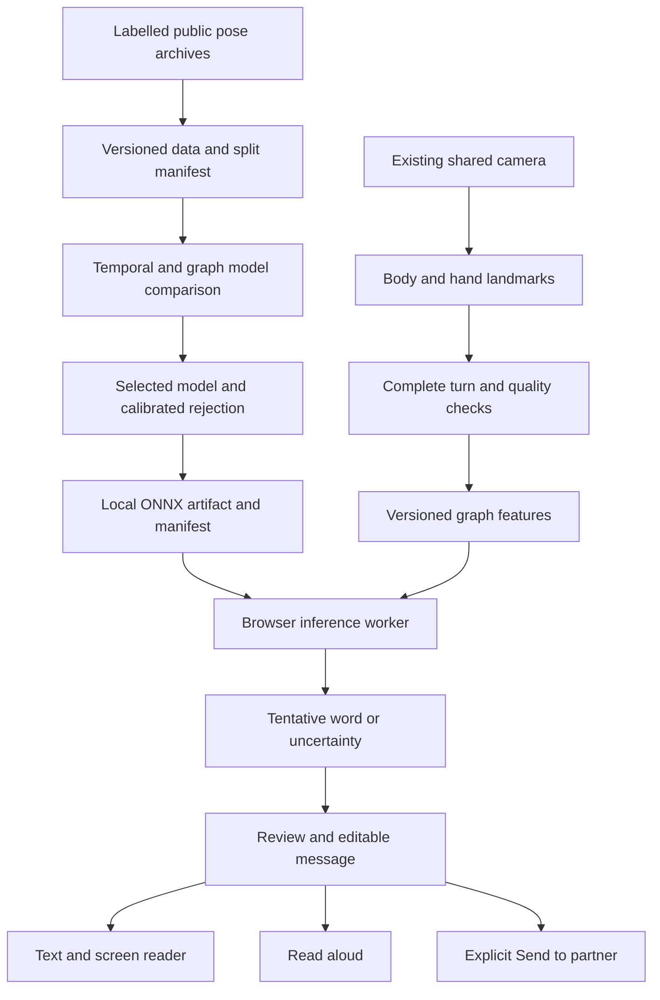

# SignBridge — joint-graph model implementation plan

Prepared 4 October 2026. Target window: **4 October–2 November 2026**, 30 days. This is an implementation plan; new graph training, runtime integration and live accuracy are not completed by this document.

## Outcome and scope

Build a measured, local sign-word recognizer that takes a complete camera turn, produces a tentative meaning, lets the user review/correct it, and converts the reviewed text to speech or sends it to a partner. ISL and ASL have separate models, vocabularies and results. Start execution with ISL to establish the pipeline, then repeat the same experiment for ASL.

The product direction remains a camera conversation as convenient as voice chat. This month establishes its recognition foundation and responsive turn controls. Unrestricted continuous sign-to-sentence translation, fluent generated sign replies, facial grammar and hardware are later programmes. Dictionary glosses or concatenated recognized labels are not automatically natural-language sentences.

Choose at most 20 useful demonstration labels per language from source metadata/training availability before final test evaluation. Keep the full 49/100-class benchmark for the architectural comparison; a demonstration list is not permission to hide poor classes or claim reliable recognition of every listed word. Each language's demonstrated coverage must be measured separately.

The user does not know sign language and has no fluent participants available. Public labelled pose recordings are the initial training source; personal data collection is not a prerequisite. Fluent-user evaluation is required before claiming practical translation quality. Without those participants, report dataset results and engineering checks only.

Keep the existing Connect rooms, text, voice, camera and manual review flows. Do not combine a new recognition model with unrelated conversation redesign or hardware work. This plan reprioritizes the recognition work from the earlier software roadmap; it does not promise to run two full month-long programmes simultaneously.

## Checked starting point

- The laptop has the original INCLUDE/ISL and WLASL/ASL OpenHands pose archives and prepared datasets. The raw archives contain temporal 75-landmark body/hand recordings: body33 + left21 + right21. They contain no face mesh.
- Prepared NPZ arrays contain only the existing 27 selected joints, resampled to 32 frames with x/y/confidence. Missing hand details cannot be recovered from those smaller arrays; read the source archives again through the existing restricted loader.
- The current isolated-word model is a GRU64, not a graph network. Its local artifacts have 49 ISL and 100 ASL labels. Joint skeletons drawn on the camera do not change this learned architecture.
- The current tracker is synchronous CPU processing, capped at eight pose samples per second. Camera video frame rate and tracked-pose sample rate are different measurements.
- Historical recording-level results are 75.00% ISL and 40.78% ASL top-1 before rejection. Correctly accepted known-example coverage is 46.88%/8.63%; unknown false accepts are 13.50%/4.50%. These do not establish live or unfamiliar-signer accuracy. See [the existing evaluation](model-evaluation-2026-10-03/README.md).
- ISL source metadata lacks signer identities. Most ASL test signers overlap training. The previously inspected test benchmark cannot be described as a newly untouched test.
- Hand-joint previews, local reviewed speech and shared camera lifecycle are already implemented. Latest application verification reported 418 checks and successful builds; this is not a recognition-accuracy score.

## Architecture

Recognition runs locally and does not require Gemini. Optional AI help remains a separate explicit action. Neither an LLM nor speech synthesis should fill gaps in an uncertain recognition result.

### Data and feature contract

Create `signbridge-pose75-xyc-v1`: **32 frames × 75 joints × 3 channels**. Channels are shoulder-normalized x/y and confidence. Preserve all 21 joints per hand, fixed MediaPipe ordering and anatomical graph edges, including body-wrist to hand-wrist links. Store graph adjacency once in the versioned contract rather than drawing graph images or repeating fixed edges in every sample.

The first experiment excludes z because body/hand depth conventions need separate validation. It excludes facial features because they are absent from the source data. Do not invent missing coordinates, infer facial grammar from a nose point, or silently change the legacy feature contract.

Reuse bounded raw-pose validation, confidence masking, shoulder normalization, trimming and declared 32-frame resampling for a controlled first comparison. Learn any dataset-level mean/std from training only. Missing joints remain masked. Record real capture timestamps and gaps for quality checks, but keep frame-index resampling in this initial contract so archived recordings with unknown frame timing and webcam data do not silently use different preprocessing. A future time-aware contract needs separately validated source timing and retraining.

For the new full-joint contract, preserve a validity mask from raw confidence and the shoulder/frame quality gate. Calculate coordinate mean/std from valid training values only; keep the confidence channel in [0,1] without standardizing it. Apply coordinate standardization, then reapply the mask so subtracting the training mean cannot turn an absent joint into a nonzero anatomical feature. Graph aggregation must exclude invalid source/destination joints, renormalize using available neighbours, and use masked pooling with a defined zero-valid-input rejection. Apply the same masking rule in the temporal baseline, Python preparation, ONNX and JavaScript preprocessing. Interpolated confidence never makes a missing observation a confidently measured joint; document the exact resampling/mask rule in parity fixtures.

Retain clip ID, source label, available signer ID, source split, exclusions and file hashes. Keep original archives, old prepared arrays and current deployed weights unchanged. Write new prepared data and runs to separate ignored directories. Source clips, labels and split membership must match across compared models; quality exclusions are logged and applied identically.

### Model experiment

| Model | Purpose | Input |
| --- | --- | --- |
| Existing GRU27 | Historical deployed reference, unchanged weights and operating point | Current 32×81 contract |
| Full-joint temporal baseline | Test whether retaining finger/body information helps without a graph | New 32×225 features; GRU64 |
| Small graph-temporal model | Test whether explicit joint connections add value | Same 75-joint features; fixed anatomical graph and temporal blocks |

For fair contemporary comparison, also rerun GRU27 under the declared training budget. Treat that as a control run, not a fourth architecture search. The full-joint temporal and graph models must use exactly the same feature arrays and splits. Any upper-body-only, motion-channel, augmentation or larger-network ablation is deferred unless it was preregistered before final test evaluation and fits the buffer.

Start the graph candidate with three modest residual graph/temporal blocks, temporal kernel 5, widths 32/64/64, pooling, dropout and a class head. Use separate language artifacts rather than merging ISL and ASL labels. Use standard exportable tensor operations; target fewer than 500,000 parameters and a model artifact below 5 MB. These are engineering budgets to check, not measured facts.

Use the existing CPU environment first. Run seeds 42, 43 and 44 with a shared epoch ceiling, validation-based early stopping, comparable optimization/search budget and a recorded wall-clock budget. GPU setup is optional only if measured CPU training becomes a bottleneck. Do not expand vocabulary or tune model structure after inspecting final test mistakes.

Before investing in these runs, Phase 1 includes a tiny untrained graph export/worker spike using the intended operations and input shape. Verify ONNX export, pinned runtime loading and numerical agreement on artificial tensors; this is an operator-compatibility check, never a sign-recognition result. Benchmark the current detector/preprocessor/classifier stages during the same phase. Unsupported operators or an unusable runtime change the implementation choice before the training budget is spent.

### Evaluation and selection

1. Freeze source clip inventories, split policies, quality gates and selection metrics before training. Normalize and augment training only; choose checkpoints, architecture and rejection thresholds using validation only.
2. Keep known validation, unknown validation, known test and unknown test separate. Unknown holdouts never enter known-class training. Genuine nonsigning camera movements require a separate negative collection; unknown signs alone do not measure idle false positives.
3. Select a winner from validation results, then freeze its weights, vocabulary, feature contract, operating point and hashes before one final benchmark evaluation. Report all preregistered models; do not revise the design repeatedly against the already inspected test set.
4. Report top-1, macro recall, per-word counts, accepted-correct coverage, accepted mistakes, rejected known signs, unknown false accepts and confidence intervals. Show the legacy deployed operating point separately from calibrated comparisons. Seed variation and small test counts must remain visible.
5. Where ASL signer metadata permits, prepare a separate signer-disjoint study with declared class coverage and new control runs. Do not compare its results directly with old splits. Missing signer/class coverage is an explicit limitation; never invent ISL signer IDs.

Proposed experimental operating targets are **95% precision among accepted known-word examples**, **60% correctly accepted known-example coverage**, and **no more than 5% unknown-sign false accepts**. They are separate metrics; known-word precision does not include the negative mixture. Also report combined mistakes and precision for the declared complete mixture. These targets are not achieved results or guarantees.

Freeze the same calibration grid and objective for all architectures: confidence thresholds 0.50–0.99 in steps of 0.01 and top-two margins 0.05–0.50 in steps of 0.05. Among validation points meeting the declared known-precision and unknown-false-accept screens, maximize accepted-correct coverage; ties prefer fewer accepted known mistakes, fewer unknown accepts, then the higher threshold/margin. If no point qualifies, automatic acceptance is disabled. The stated percentages are point-estimate screens, with confidence intervals reported rather than an implied interval-bound guarantee. For the known/unknown mixture, combined precision is accepted-known-correct divided by (accepted-known-correct + accepted-known-wrong + unknown-false-accepts); include nonsigning false accepts in the denominator when that separate collection exists. State the mixture and counts. Report seeds separately and their variation; three predictions of one clip do not become three independent test observations.

Candidate promotion requires useful validation improvement across seeds without worsening the declared error/rejection budget, a final frozen evaluation that supports the same bounded claim, runtime/parity checks and a documented limitation statement. Aim for at least five percentage points of accepted-correct coverage improvement at matched safety targets. Failed promotion candidates remain in offline research reports; they do not replace the app model. If no model meets the gates, retain the existing reviewed baseline, clearly experimental where it misses the new targets, and publish the comparison honestly. Passing architecture selection does not bypass rejection, parity or runtime gates. Do not lower thresholds merely to make the app produce more speech.

## Browser runtime and product integration

Use **PyTorch training → ONNX export → ONNX Runtime Web/WASM inside an explicit module worker**. Browser inference and WASM are supported by the [official ONNX Runtime Web documentation](https://onnxruntime.ai/docs/tutorials/web/). Single-thread WASM is the initial compatibility baseline. Package matching JavaScript/WASM versions and self-host runtime assets; WebGPU is an optional later optimization, not a requirement. Cross-origin isolation or proxy workers must not be assumed to work automatically. [Runtime configuration](https://onnxruntime.ai/docs/tutorials/web/env-flags-and-session-options.html).

The new artifact manifest includes model ID/version, language, label order, feature contract, node order/adjacency hash, input/output shape, normalization, calibrated thresholds, file hashes/size, dataset provenance, evaluation summary and distribution status. Reject missing, corrupt, oversized, mismatched-language and unsupported-contract artifacts. Keep the legacy JSON GRU path available. Activate an experimental artifact explicitly, with no automatic fallback to a different language.

Worker messages carry `requestId`, capture/session generation, model version and sign language. Support init, predict and dispose; logical cancel increments the generation and ignores stale results because native inference may not be interruptible. Permit one inference in flight and bound queued work. Dispose old model sessions on language/model changes. Cancel late imports/results on unmount, camera loss, room/session end and retries. Worker failure leaves typing, live camera conversation and reviewed drafts usable.

The worker accepts landmarks, not a newly acquired camera stream. `useRoomMedia` remains the owner of Connect tracks. Preserve one camera stream, no automatic footage upload/save, explicit Send, draft retention and local recognition independent of room/AI availability. Include clear tracking-ready, model-ready and recognized/uncertain/rejected states.

Keep manual **Capture → Finish → Review** as the first reliable flow. Add an opt-in guided live-word mode only after validation and performance gates pass. It may suggest turn completion; Finish/Cancel remains available. Hand lowering, motion pauses and repeated overlapping windows must not automatically become sentence boundaries or duplicate words. Stable handshapes may carry meaning; repeated instances of the same sign must remain possible. Ordinary movements must not be spoken automatically.

Declare the camera input-quality gate before device trials: minimum real hand/shoulder samples, actual timestamp-gap bound, complete-turn duration and maximum frame count. Tracking pauses beyond the declared bound return a recapture request instead of interpolating across long dropouts and presenting a word as reliable. Report quality-gate exclusions separately from classifier rejections and include them in end-to-end coverage. Archived clips without reliable timing retain an explicit unknown-timing status; do not fabricate timestamps to make them pass this device gate.

Text and speech use the reviewed text's actual language metadata. English dataset glosses are initially displayed/spoken as English. Tamil speech requires reviewed Tamil text or separately checked mappings; choosing Tamil output does not make a model understand sentence meaning. Uncertain candidates remain editable and require explicit confirmation. Capture stops dictation/playback as appropriate, and read aloud does not become new dictated input.

### Performance and parity gates

- Compare Python preprocessing with JavaScript on real raw source clips, including missing joints/shoulders and unequal sequence lengths. Initial float32 feature tolerance target: maximum absolute error at most `1e-5`.
- Compare PyTorch, exported ONNX and browser-runtime probabilities on frozen fixtures. Initial probability tolerance target: `1e-4`; report measured error. Top-1 and accept/reject decisions must match on fixtures; threshold-boundary disagreement fails promotion and requires investigation, not arbitrary tolerance relaxation.
- Measure warm and cold startup, model inference, tracker sample rate/gaps, memory and UI responsiveness separately. Model speed alone does not establish end-to-end speed.
- Proposed laptop warm Finish-to-result target: p95 at most one second, measured over at least 50 runs. At least 20 capture/cancel/change-language/end cycles must produce no late word/speech or retained owned tracks.
- Establish the actual tracker baseline before increasing its eight-Hz cap. Trial a bounded higher sample rate only when processing/backlog and UI measurements permit it. Do not promise 30-Hz pose extraction or use repeated frames to inflate reported FPS.
- If tracking blocks the UI, investigate a separate frame-processing worker with bounded transferable frames and supported MediaPipe image inputs. This is a stretch item requiring an actual compatibility test; the ONNX worker alone does not move the existing tracker off the main thread.
- Actual Chrome/Android, audible output and known-sign trials are reported separately from Node/Vitest fixtures. Browser inspection is currently blocked by tool policy, so user-run device checks remain necessary until an approved inspection path is available. Do not bypass the restriction through a different browser or indirect commands.

## Thirty-day execution sequence

Plan approximately 24 days of core work plus six days of integration/research buffer. Dates are targets, conditional on experiment results and active implementation time; this document does not schedule autonomous future runs.

| Phase | Target dates | Core work | Completion evidence |
| --- | --- | --- | --- |
| 1 — Freeze the experiment | 4–7 October, days 1–4 | Inventory raw recordings, reproduce baseline, declare full-joint contract, candidate budgets and split/evaluation protocol; measure existing stages and test a tiny ONNX/worker export | Versioned manifest, baseline report, export/runtime compatibility evidence, no overlap/feature-contract failures |
| 2 — Prepare graph data | 8–12 October, days 5–9 | Rehydrate exact clip IDs, build 75-joint arrays/edges, mask missing joints, mirror Python/JS preprocessing | Deterministic arrays, exclusion/hash inventory, meaningful feature regressions and parity fixtures |
| 3 — Train and compare | 13–18 October, days 10–15 | ISL first, then ASL; bounded control/temporal/graph runs; validation-only selection and rejection | Three-way comparison per language, seed variation, frozen candidate and explicit pass/fail decision |
| 4 — Integrate the selected runtime | 19–24 October, days 16–21 | ONNX export, worker/manifest loading, manual turn integration, review and text/voice output | Numerical agreement, cancellation/error tests, documented device latency and fallback |
| 5 — Demo and product checks | 25–27 October, days 22–24 | End-to-end fixed-word demo, unsupported/idle cases, microphone/camera errors, reconnect/history, supported output language behavior | Repeatable run sheet separating dataset evidence, user device checks and unverified fluent trials |
| Buffer / optional live-word mode | 28 October–2 November, days 25–30 | Fix failures; guided auto-finish or ASL runtime completion only if core gates pass | Stable limited-word prototype or honest benchmark with current manual flow retained |

If data/selection slips, cut guided auto-finish, WebGPU, tracker-worker migration, extra channels and vocabulary expansion first. ISL can complete the new local pipeline while ASL stays on its existing experimental baseline, with its new status reported as incomplete. Existing ASL support is retained. Do not cut rejection, parity, review, split integrity or failure handling.

## Implementation work packages

These paths are proposed deliverables, not files already created by this plan.

| Work package | Proposed files / integration points | Dependencies |
| --- | --- | --- |
| Data contract and reconstruction | `training/pose_graph.py`, `training/prepare_graph_data.py`; reuse validated archive access in `prepare_data.py` | Frozen source/clip inventory |
| Training / comparison | `training/train_graph_models.py`, `training/evaluate_graph_models.py`, graph requirements file, run manifests/reports | Versioned prepared data and budgets |
| Model export / parity | `training/export_graph_model.py`, `training/check-graph-parity.mjs`, raw-pose and probability fixtures | Frozen model/thresholds |
| Browser inference | `src/lib/poseGraphFeatures.js`, `src/lib/graphSignModel.js`, `src/workers/graphSign.worker.js`, `src/hooks/useGraphSignModel.js` | Export/manifest/parity |
| Turn integration | `RoomSignCapture.jsx`, `TrainedSignMode.jsx`, shared model adapter; optional later turn segmenter | Selected runtime, cancellation and availability states |
| Reliability | Feature/model/runtime regressions, existing room/media/speech tests, user device run sheet | Relevant work package ready |
| Public packaging | Existing `build:public` and server asset controls; cover all new model extensions and worker assets | Artifact distribution status and successful release checks |

Store graph data under `.training-data/graph-v1/`, run artifacts under `training/artifacts/graph-v1/`, and aggregate shareable reports under `docs/graph-model-evaluation/<run-id>/`. Extend ignore rules for new experimental binary formats before generating them. Do not print or commit individual pose sequences, private participant metadata, videos or keys.

## Responsibilities and operating cost

| Owner | Work |
| --- | --- |
| Codex | Data preparation, model/training/export code, bounded experiments, measured comparisons, worker integration, tests, documentation and clear pass/fail reporting |
| User | Keep laptop available during agreed runs; approximately 15–30 minutes for each requested device trial; report actual camera/voice results; optionally learn a few reference signs |
| Later fluent reviewer | Check natural signing, meanings/context, dialect coverage and usefulness; provide consented recordings only when a collection study is arranged |

The user does not need to label unfamiliar signs or recruit a training cohort to start. Self-imitation and synthetic/random gestures are engineering smoke tests only; they do not establish linguistic correctness. Participant access remains an open dependency for real-world validation.

Use the existing local training environment and datasets first: no paid API or new hardware required for this experiment. Recognition has no Gemini key dependency. Render service setup and TURN account/relay configuration remain separate room-deployment work, not prerequisites for local model research. No free hosting allowance is treated as unlimited compute or a model-training service.

Keep research models local by default and preserve current public-build exclusions. The [WLASL authors](https://github.com/dxli94/WLASL) specify academic/computational use and noncommercial conditions; the aggregate pose release is not blanket permission to ignore underlying source terms. A public model package needs an explicitly documented distribution status and allowed artifacts. The remote app can still support direct signing video, reviewed text and voice while research weights are absent. Do not turn a new `.onnx` filename into an accidental public artifact bypass.

## Later continuous-language programme

After the limited-word experiment, audit paired sentence datasets, source access/terms, annotations, signer splits and camera domain differences. ISLTranslate reports 31,000 ISL-English sentence/phrase pairs; this is a relevant research lead, not data currently downloaded or a ready laptop translator. [ISLTranslate paper](https://arxiv.org/abs/2307.05440).

This next programme needs facial/nonmanual information where supported, continuous-turn and coarticulation modelling, sentence-level language decoding, target-language translation, fingerspelling/names, latency evaluation and fluent reviewers. Evaluate meaning preservation and harmful omissions rather than counting a grammatical-looking LLM sentence as a successful translation. Support recognition uncertainty instead of generating confident missing content.

The immediate next implementation step is **Phase 1: freeze the data/feature/evaluation manifest and reproduce the baseline**. New graph training starts after those foundations are concrete; model promotion depends on measured results.
